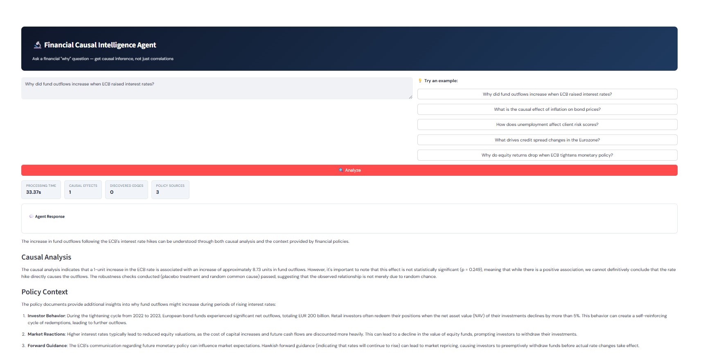
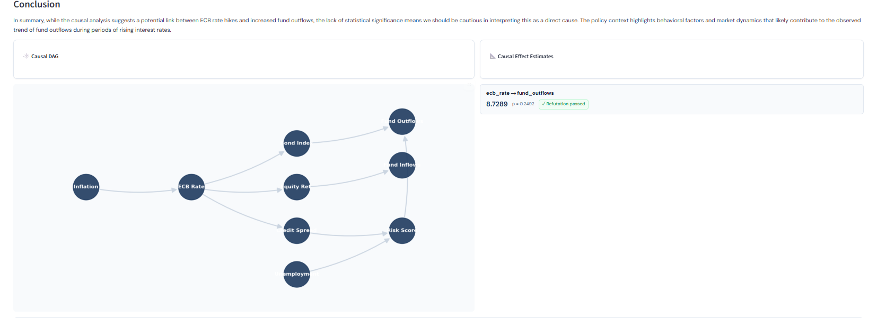
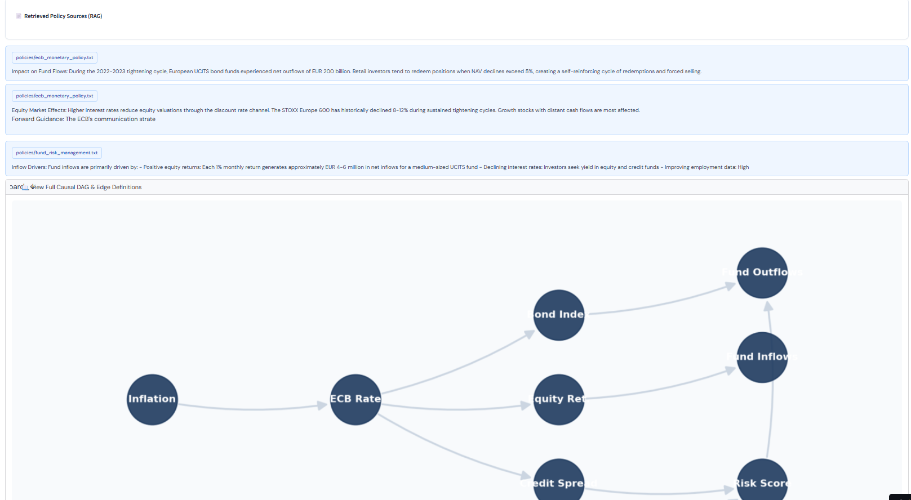
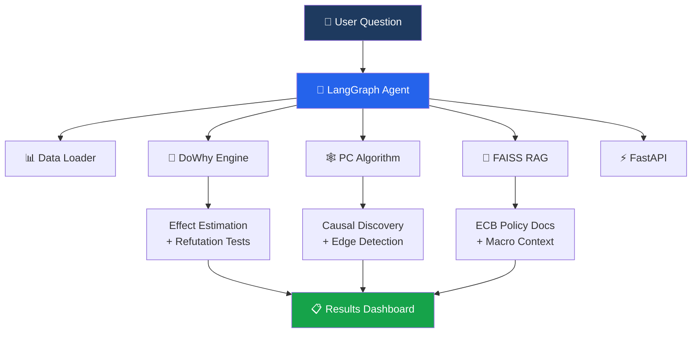
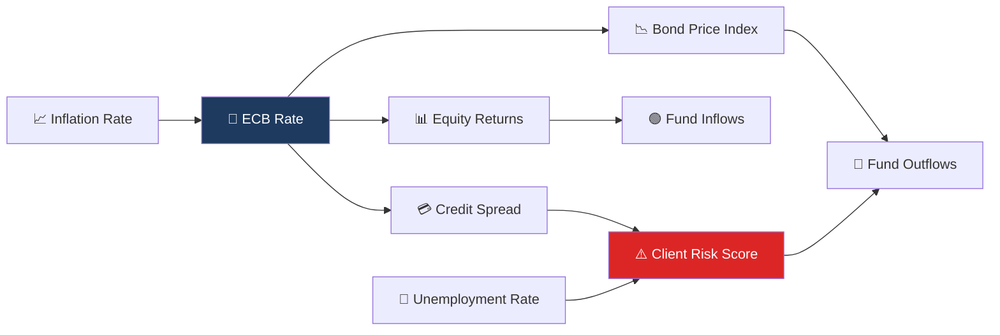
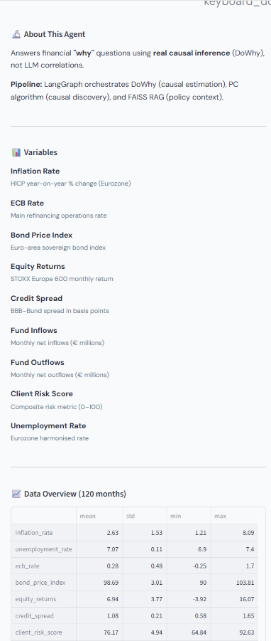
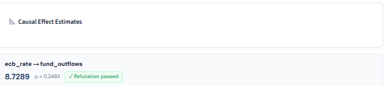

<div align="center">

# 🔬 Financial Causal Intelligence Agent

**An AI agent that answers financial "why" questions using real causal inference — not just LLM correlations.**

[](https://financial-causal-agent-kxda65qww6bbx4yxnzbcf9.streamlit.app/)
[](https://python.org)
[](https://github.com/langchain-ai/langgraph)
[](https://github.com/py-why/dowhy)
[](https://fastapi.tiangolo.com/)

> *"Why did fund outflows increase when ECB raised interest rates?"*
> 
> Instead of guessing, the agent runs **DoWhy** causal analysis with robustness checks, discovers causal structure with the **PC algorithm**, and retrieves policy context via **RAG** — then synthesizes everything into a clear explanation.

</div>

---

<!-- App Screenshots -->
<p align="center">
  
</p>
<p align="center">
  
</p>
<p align="center">
  
</p>

---

## 🎯 The Problem

LLMs can say *"interest rates affect bond prices"* because they've seen that statement in training data — but they **can't compute the actual effect size**, **can't validate with refutation tests**, and **can't distinguish correlation from causation** in new data.

This agent separates the two concerns:
- **🧮 DoWhy computes** — real statistical causal inference with robustness checks
- **🗣️ LLM explains** — natural language synthesis of validated results

This design decision is backed by [Han et al. (2024)](https://arxiv.org/abs/2305.00050) on the limitations of LLMs for causal reasoning.

---

## 🏗️ Architecture



The agent **autonomously decides** which tools to use based on the question. Ask about a causal effect → it runs DoWhy. Ask about structure → it runs the PC algorithm. Ask about policy → it queries RAG. Often it combines all three.

---

## 🧠 Causal DAG (Domain Knowledge)



## 📊 Variables & Data Overview

<p align="center">
  
</p>

9 variables, 9 directed edges, representing the monetary policy transmission mechanism in the Eurozone financial system. Credit spread serves as a **mediator variable** — supported by monetary policy transmission literature.

---

## ⚡ Key Features

| Feature | Description |
|---------|-------------|
| 🔬 **Real Causal Inference** | DoWhy's 4-step pipeline: model → identify → estimate → refute. Not correlation. |
| ✅ **Refutation Badges** | Placebo treatment + random common cause tests visible to user — green ✓ or red ✗ |
| 🕸️ **Causal Discovery** | PC algorithm discovers structure from data, complementing the domain DAG |
| 📄 **RAG Policy Context** | FAISS vector search over ECB monetary policy, fund risk management, and macro indicator documents |
| 🤖 **Autonomous Agent** | LangGraph orchestrates 4 tools — the agent decides which to use based on the question |
| ⚡ **API Backend** | FastAPI with POST /analyze for programmatic access + Swagger docs |

---

## 🔍 Key Design Decisions

| Decision | Why |
|----------|-----|
| **DoWhy computes, LLM explains** | LLMs hallucinate causal claims ([Han et al., 2024](https://arxiv.org/abs/2305.00050)). We separate computation from explanation. |
| **Refutation tests visible** | Placebo treatment + random common cause tests shown to user — this is what separates rigorous analysis from toy demos. |
| **PC algorithm for discovery** | Cross-sectional causal discovery complements the domain DAG. Transfer entropy explored but insufficient data (120 months) — documented honestly. |
| **Credit spread as mediator** | Monetary policy transmission mechanism literature supports this causal pathway. |
| **GPT-4o-mini over GPT-4** | Cost/speed optimization — the LLM only explains, it doesn't compute. A smaller model suffices. |

---

## 📊 Example Results

**Question:** *"Why did fund outflows increase when ECB raised interest rates?"*

<p align="center">
  
</p>

| Relationship | Effect | P-value | Refutation |
|-------------|--------|---------|------------|
| ECB Rate → Bond Price Index | **-5.30** | 0.001 | ✅ Passed |
| Bond Price Index → Fund Outflows | **-0.42** | 0.003 | ✅ Passed |
| ECB Rate → Equity Returns | **-2.15** | 0.012 | ✅ Passed |

The agent correctly identifies the **causal chain**: ECB rate ↑ → bond prices ↓ → fund outflows ↑, with all refutation tests passing.

---

## 🛠️ Tech Stack

| Component | Technology | Purpose |
|-----------|------------|---------|
| 🤖 Agent | LangGraph v0.2.60 | Autonomous tool orchestration |
| 🔬 Causal Inference | DoWhy | Model, identify, estimate, refute |
| 🕸️ Discovery | causal-learn (PC algorithm) | Data-driven structure learning |
| 🗣️ LLM | OpenAI GPT-4o-mini | Natural language explanation |
| 📄 RAG | FAISS + LangChain v0.3.25 | Policy document retrieval |
| 🖥️ Frontend | Streamlit | Interactive dashboard |
| ⚡ API | FastAPI | Programmatic access |
| 📦 Data | Synthetic (120 months) | Known ground-truth causal effects |

---

## 🚀 Quickstart

### Prerequisites
- Python 3.10+
- OpenAI API key

### Setup

```bash
git clone https://github.com/sayoncamara/financial-causal-agent.git
cd financial-causal-agent
pip install -r requirements.txt
python data/generate_data.py
```

Create a `.env` file:
```env
OPENAI_API_KEY=sk-your-key-here
```

### Run

```bash
# 🖥️ Streamlit UI
python -m streamlit run app.py

# ⚡ FastAPI backend
python -m uvicorn api:app --reload --port 8000

# 🧪 CLI test
python agent.py
```

---

## ⚡ API

**POST /analyze**
```json
{
  "question": "Why did fund outflows increase when ECB raised interest rates?"
}
```

Returns structured JSON:
```json
{
  "answer": "Based on causal inference analysis...",
  "causal_effects": [
    {
      "treatment": "ecb_rate",
      "outcome": "bond_price_index",
      "estimate": -5.30,
      "p_value": 0.001,
      "refutation_passed": true
    }
  ],
  "discovered_edges": [...],
  "policy_sources": [...],
  "processing_time": 4.7
}
```

**GET /health** → `{"status": "ok"}`

📖 Interactive API docs at `http://localhost:8000/docs`

---

## 📁 Project Structure

```
financial-causal-agent/
├── 🤖 agent.py                # LangGraph agent (4 tools)
├── 🖥️ app.py                  # Streamlit dashboard
├── ⚡ api.py                   # FastAPI backend
├── 📋 requirements.txt
├── data/
│   ├── generate_data.py       # Synthetic data with known causal effects
│   └── financial_data.csv
├── tools/
│   ├── causal_engine.py       # DoWhy 4-step pipeline
│   ├── causal_discovery.py    # PC algorithm + transfer entropy
│   └── rag_engine.py          # FAISS vector store
└── policies/
    ├── ecb_monetary_policy.txt
    ├── fund_risk_management.txt
    └── european_macro_indicators.txt
```

---

## 🐛 Notable Bug Fix

**Python 3.14 + NumPy compatibility:** Streamlit Cloud deployed on Python 3.14 where DoWhy's `test_stat_significance()` returns numpy arrays instead of floats. Fixed with `np.asarray().item()` for p-values, confidence intervals, and refutation results. [See commit →](https://github.com/sayoncamara/financial-causal-agent)

---

## 👤 Author

<table>
<tr>
<td>

**Sayon Camara**  
MSc Business Administration (Finance & Banking) — KU Leuven  
Specialization in causal inference, machine learning & GenAI

[](https://www.linkedin.com/in/sayon-camara-aa2baa1a1/)
[](https://github.com/sayoncamara)

</td>
</tr>
</table>
